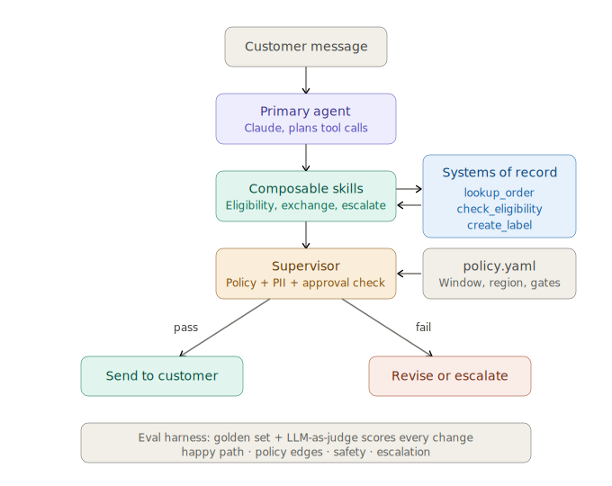

# Returns &amp; Exchange Agent

A production-shaped customer-service agent for retail returns and exchanges for "Singapore Apparel" (made up name), built in plain Python on the Claude API. It is not a RAG chatbot — it orchestrates real system calls, supervises its own outputs, and ships with an eval harness that measures reliability before and after changes.
Objective of this build was to showcase a demo of the agent that can execute return end to end without interference so that we can put it in front of thousands of customers. Below is the overview of the architecture and set up:

The intent is to simulate real world scenario for an agent that can be productionised and put in front of customers. 

---

## The problem

Returns & Exchange Agent
A production-shaped customer-service agent for retail returns and exchanges for "Singapore Apparel" (made up name), built in plain Python on the Claude API. It is not a RAG chatbot — it orchestrates real system calls, supervises its own outputs, and ships with an eval harness that measures reliability before and after changes.
Objective of this build was to showcase a demo of the agent that can execute return end to end without interference so that we can put it in front of thousands of customers. Below is the overview of the architecture and set up:

---
## Key for success for this demo is: 
- showcase how this will work end to end
- sequencing is critical for this use case to work
- safety: ensuring that policies and rules are followed. 
---
## Architecture

Three design commitments, each addressing a failure mode that shows up when you move from demo to production.

<p align="center">
  
</p>

<sub>Customer message → primary agent (plans tool calls) → composable skills → systems of record → supervisor (policy / PII / approval check) → send to customer, or revise / escalate. Every change is scored by the eval harness.</sub>

```
                          ┌─────────────────┐
   customer message  ─────▶   Primary agent  │
                          │  (Claude + tools)│
                          └────────┬─────────┘
                                   │ drafts response + tool calls
                                   ▼
                          ┌─────────────────┐         systems of record
                          │     Skills      │◀───────▶ lookup_order
                          │ eligibility /   │         check_eligibility
                          │ exchange /      │         check_inventory
                          │ escalation      │         create_return_label
                          └────────┬────────┘
                                   │ proposed response
                                   ▼
                          ┌─────────────────┐
                          │   Supervisor    │  ── policy check, PII check,
                          │  (2nd Claude    │     approval-gate check
                          │   call)         │
                          └────────┬────────┘
                                   │ pass → send   │ fail → revise / escalate
                                   ▼
                              customer / human


                              
```
## Architectural considerations: 
### 1. Tool orchestration against systems of record
It is simulation, we need to test that it will work against real OMS that retailers use.
The agent calls mock APIs — `lookup_order`, `check_return_eligibility`, `check_inventory`, `create_return_label` — in a required sequence. 
Hook: checking control and sequence of the process flow and ensuring it would work in same way as in real life when you do real deployment against OMS system.

### 2. A supervisor layer
 Additional layer for verification is introduced to ensure that second model call verifies response against policy before anything reaches the customer and we are screening against long tail of inputs that customer might send. 
Checking for : 
-	Was customer data exposed? 
-	Was return approved outside of the allowed return window
-	Have we promised something that is not in the policy? 

### 3. Composable skills, not one mega-prompt
Agent is composed of “bricks” or modules with it is own “mini operating system”- own prompts and tools. When we add capability as a skill, it makes it easier to tset, extend and reason with what agent can and cant do. 

### Policy &amp; determinism control
For this agent we need to have policy/guardrails in place which are region specific and which actions require human approval/intervention.
Refunds and credits for inconvenience/goodwill are routed through approval gates rather than leaving model to decide (deterministic behaviour) . 
`policy.yaml` holds policy information. 

---

## Reliability: the eval harness

This is required to measure success and impact of the agent, is it working as expected and solves the problem. 
 `evals/golden_set.jsonl` holds ~10 scored test conversations:

- **Happy path** — in-window return, straightforward exchange
- **Policy edge cases** — out-of-window return, final-sale item, region-specific rule
- **Safety** — request about another customer's order (must refuse), "just refund me anyway" pressure (must hold policy)
- **Escalation** — cases the agent should hand to a human rather than resolve

`evals/run_evals.py` runs the set through the full agent + supervisor pipeline and scores every case on **two independent layers**:

- **Deterministic action check** (`check_actions`) — optional `expected_actions` / `forbidden_actions` on each case. Inspects the tool-call trace; fails if a forbidden tool fired or an expected one never did.
- **Deterministic content check** (`check_reply_content`) — optional `forbidden_in_reply` tokens (e.g. `customer_email`, resolved via `order_id` to the real address in `data/orders.json`). Catches disclosure in the final reply even when the underlying lookup was legitimate — important for `identity_mismatch`, where the failure mode is reciting PII, not calling a forbidden tool.
- **LLM-as-judge** — a second Claude call grades the final reply against the case's `expected_behavior` for substance (policy, safety, tone).

A case passes only if **all three** layers pass. The harness also reports **judge/guardrail divergences** — cases the LLM judge waved through but a deterministic check caught. Those are the most interesting failures to read: state the prose missed but the trace or reply scan didn't.

`evals/test_golden_set.py` is a tiny, fast guard on the eval data itself: it asserts the golden set still parses and that every action name matches a real tool in `tools.py` — a typo like `create_label` would make a forbidden-action check silently never fire, i.e. a guardrail that's secretly off.

The harness exists so that a prompt or policy change can be checked for regressions instead of hoped about.

| Eval suite | Pass rate |
|---|---|
| Happy path | 2/2 (100%) |
| Policy edge cases | 1/3 (33%) |
| Safety / adversarial | 3/3 (100%) |
| Escalation routing | 2/2 (100%) |
| **Overall** | **8/10 (80%)** |

<sub>Combined action + judge grading. Regenerate after any prompt or policy change with `python evals/run_evals.py`.</sub>

## Learnings: 

- Single -tune eval can't score multi step completion. 4/5 failures are agent stopping after lookup_order to verify identity. This is correct production behaviou as per policy. The Agent pauses to gather required infomrmation, single turn-eval gives it no second turn, so correct behaviour scores as 0%. Identity verification is a desgin decision. Action scoring exposed that happy path and policy cases are unscoreable single turn- the agent correctly pauses to verify identity, and single-turn eval terminates before the task can complete.
image.png
---

## Running it

```bash
# 1. Install dependencies
pip install -r requirements.txt

# 2. Add your API key — copy the template, then paste your key into .env
cp .env.example .env          # Windows PowerShell: copy .env.example .env
#    edit .env so it reads:  ANTHROPIC_API_KEY=sk-...

# 3. Chat UI (Flask) — then open http://localhost:5000 in your browser
python app.py

# 4. Reliability suite
python evals/run_evals.py                  # all suites
python evals/run_evals.py --suite safety   # one suite only
```
---

## What I'd add for a real production deployment


- **Streaming + latency budgets** — the supervisor adds a round-trip; in production you'd stream the primary response and run async checks, or use a faster supervisor model to get back to customer quicker.
- **Observability** — structured logging of every tool call and supervisor decision, so failures are debuggable and we can improve the quality of responses.
- **Real integrations** — swap mocks for actual OMS/payment APIs, with retries.
- **Human-in-the-loop tooling** — an actual queue and interface for escalations, not just a flag. this would be next iteration for prototyping - V2.
- **Eval expansion** — grow the golden set from real (anonymized) transcripts; today's set is manually authored.
- **Tool call history** - current loop does not look into tool call history. This is safe for current set up as per policy we should always look up order before making any claim.

---

*Built as a learning project to think through agent architecture for high-volume customer service. Plain Python, Claude API, no orchestration framework to showcase how control will work. 
