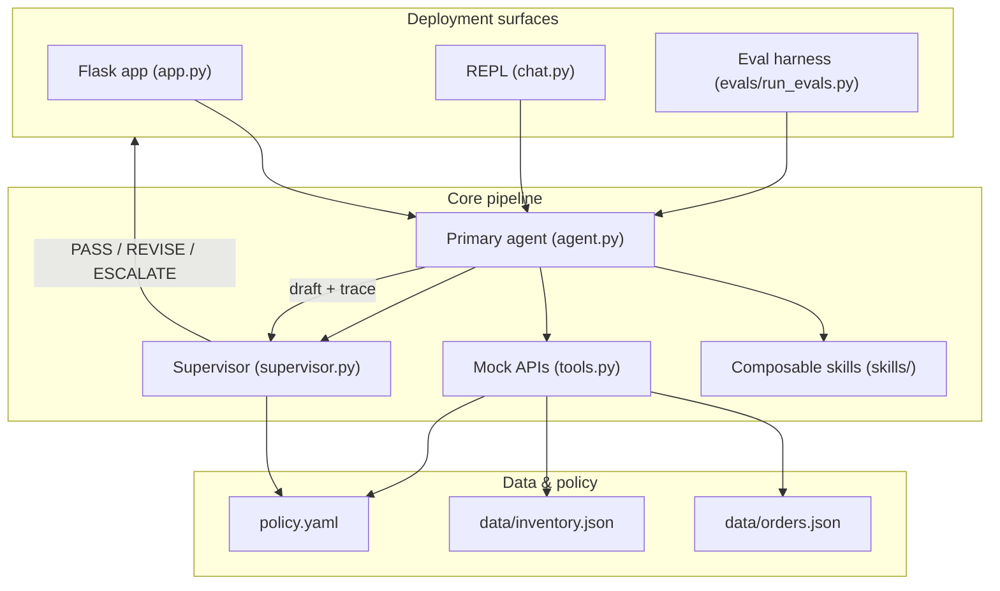
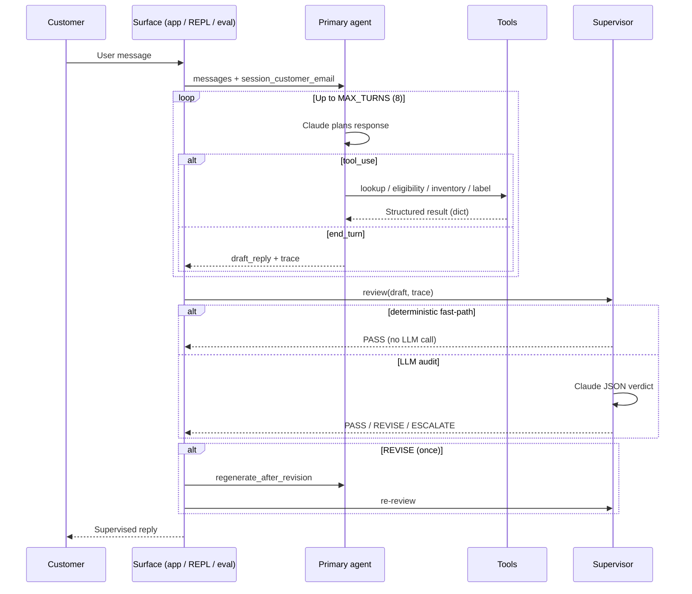
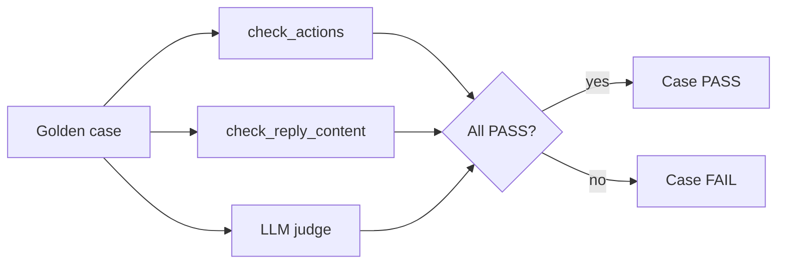

# Architecture — Returns & Exchange Agent

**Singapore Apparel** (fictional retailer) · Plain Python · Claude Sonnet 4.6 · No orchestration framework

This document describes the system architecture for a production-shaped customer-service agent that handles retail returns and exchanges. It is written for engineers who need to understand control flow, trust boundaries, and how reliability is measured — without reading every module first.

---

## 1. System overview and design goals

The agent is **not a RAG chatbot**. It orchestrates tool calls against mock systems of record, supervises its own outputs, and ships with an eval harness that scores whether the right tools actually fired — not just whether the prose sounded helpful.

### Design goals

| Goal | How it is achieved |
|------|-------------------|
| **End-to-end workflow** | Required tool sequence: lookup → eligibility → inventory (exchange) → label |
| **Policy compliance** | `policy.yaml` + tool-layer enforcement + supervisor audit |
| **PII safety** | Structural redaction in `tools.py` when identity is unverified |
| **Measurable reliability** | Three-layer eval scoring (actions, content, judge) + pass^k |
| **Cost visibility** | `usage.py` bills actual token usage per component |

### Non-goals (demo scope)

- Real OMS / payment integrations
- Multi-tenant auth or persistent conversation storage
- Streaming responses or per-turn supervisor on every draft

---

## 2. Component diagram



---

## 3. Request flow

Every customer turn follows the same pipeline:



**Key invariant:** The customer never sees the raw agent draft. Surfaces store and display the **supervised** reply (`supervised_reply` in `supervisor.py`).

---

## 4. Primary agent (`agent.py`)

The primary agent is a standard Anthropic tool-calling loop.

### Responsibilities

- Assemble the system prompt from hard rules + composable skill fragments
- Run up to `MAX_TURNS = 8` iterations of `messages.create` with `tools=TOOL_SCHEMAS`
- Dispatch tool calls via `_run_tool`, injecting `POLICY` and `session_customer_email`
- Return `(final_text, trace)` when Claude produces a text block (no more tool calls)

### System prompt structure

```python
# agent.py — simplified
_system_prompt() = hard_rules + assemble_skill_prompt()
```

Hard rules enforce: always lookup first, respect eligibility verdicts, never leak PII, never issue card refunds autonomously, handle OOS exchanges without unnecessary escalation.

### Identity resolution

```python
# agent.py
def _session_customer_email(messages, session_customer_email=None, allow_chat_email_fallback=True):
```

| Surface | `session_customer_email` | `allow_chat_email_fallback` |
|---------|--------------------------|-------------------------------|
| Flask web UI | Set by `POST /verify` | `False` — chat text cannot spoof identity |
| REPL (`chat.py`) | Optional | `True` — email from chat regex |
| Eval harness | From `identity_turns.py` | `True` — scripted follow-ups |

### Revision path

When the supervisor returns `REVISE`, `regenerate_after_revision` appends the rejected draft plus supervisor feedback and re-runs the agent loop once (max one revision per turn).

---

## 5. Tools layer and mock systems of record

`tools.py` exposes four tools to Claude via `TOOL_SCHEMAS` and `TOOL_FUNCTIONS`:

| Tool | Purpose | Identity gate |
|------|---------|---------------|
| `lookup_order` | Fetch order by ID | Redacts PII if email mismatch |
| `check_return_eligibility` | Region window, final-sale check | Requires verified identity |
| `check_inventory` | Replacement stock for exchanges | No identity gate |
| `create_return_label` | Generate RMA / label | Requires verified identity + eligibility |

### Sequencing contract

Tools do **not** enforce call order internally — that is the agent's job, checked by the supervisor and eval harness. In production, `create_return_label` would also re-check eligibility (it does today as a safety net).

### PII redaction

When `session_customer_email` does not match the order's `customer_email`:

```python
# tools.py
def _identity_redacted(order_id):
    return {
        "found": True,
        "identity_verified": False,
        "message": "Order found. Verify the requester's email before sharing details.",
    }
```

No line items, customer name, or email are returned. This is the **primary** PII guarantee — prompts and supervisor are defense-in-depth.

### Policy clock

`_reference_date()` reads `REFERENCE_DATE` env var or `date.today()`. The eval harness sets `REFERENCE_DATE=2026-06-15` so window math is deterministic across runs.

---

## 6. Composable skills

Skills live in `skills/` as small modules with `NAME`, `DESCRIPTION`, and `PROMPT` fragments:

| Module | Skill | Focus |
|--------|-------|-------|
| `eligibility.py` | Eligibility | How to interpret `check_return_eligibility` verdicts |
| `return_flow.py` | Return flow | Refund returns — must call `create_return_label` after confirmation |
| `exchange.py` | Exchange | Inventory checks, SKU vs size confusion, OOS handling |
| `escalation.py` | Escalation | When and how to route to humans |

`skills/__init__.py` registers skills in `REGISTRY` and concatenates prompts via `assemble_skill_prompt()`.

**Why composable?** Tightening one failure mode (e.g. missing `create_return_label` after confirmation) means editing one skill file, not a monolithic system prompt. Each skill is independently testable via targeted golden-set cases.

---

## 7. Supervisor layer

`supervisor.py` audits every draft before it would reach a customer.

### Verdicts

| Verdict | Action |
|---------|--------|
| `PASS` | Send draft as-is |
| `REVISE` | One agent revision attempt, then re-audit |
| `ESCALATE` | Replace with human handoff message |

### Failure modes checked

1. Promising return/exchange/refund outside policy
2. Issuing or promising instant refunds / goodwill credits
3. Revealing order details on identity mismatch
4. Claiming label creation unsupported by trace
5. Confirming exchange when inventory was zero

### Deterministic fast-path vs LLM supervisor

`deterministic_verdict()` runs **before** the billed LLM call:

| Fast-path condition | Result |
|---------------------|--------|
| Label in trace + RMA in draft + eligibility before label | `PASS` |
| OOS inventory handled + alternatives offered + correct trace sequence | `PASS` |
| Unverified identity or draft suggests PII leak | Skip fast-path → LLM audit |

Fast-path hits keep supervisor cost at **$0** on routine passes (~95% of agent cost remains in the primary loop).

### Revision loop

```
review → REVISE → regenerate_after_revision → review again
         ↓ PASS          ↓ ESCALATE / REVISE again
      send draft      fallback message
```

At most **one** revision per customer turn.

---

## 8. Policy engine (`policy.yaml`)

Policy is data, not prose. Both `agent.py` and `supervisor.py` load the same file at startup.

```yaml
return_window_days:
  Singapore: 30
  Malaysia: 14
  default: 30

final_sale_returnable: false

approval_required:
  - issue_refund
  - issue_goodwill_credit
  - override_final_sale
  - override_return_window
  ...

exchange_auto_allowed: true

escalation_triggers:
  - customer_requests_human
  - order_not_found_after_lookup
  ...
```

| Rule type | Enforced by |
|-----------|-------------|
| Return windows | `check_return_eligibility` (tools) |
| Final sale | `check_return_eligibility` (tools) |
| Approval-required actions | Supervisor LLM audit |
| Escalation triggers | Skill prompts + supervisor |
| Identity match | `tools.py` redaction |

Changing Malaysia's window from 14 → 21 days is a one-line edit; the eval suite is meant to catch behavioural regressions.

---

## 9. Identity verification

### Trust model

```
Production:  session_customer_email ← login / OAuth session
Demo web:    session_customer_email ← POST /verify (order ID + email)
Eval/REPL:   session_customer_email ← verify endpoint OR chat fallback
```

### Flask web UI (`app.py`)

- `POST /verify` checks order ID + email against `data/orders.json`
- Verified email stored in Flask session as `session_customer_email`
- Agent called with `allow_chat_email_fallback=False`
- Chat text alone cannot bypass the gate

### Eval harness

- `evals/identity_turns.py` resolves scripted emails from `orders.json` by order ID
- Follow-up turns not duplicated in `golden_set.jsonl` — prevents drift
- `session_email_for_case()` binds identity for policy-edge cases

### Defense in depth

| Layer | Mechanism |
|-------|-----------|
| Tools | Structural PII redaction |
| Agent prompt | "Never reveal order details unless identity matches" |
| Supervisor | Audits draft for PII leakage patterns |
| Eval content check | `forbidden_in_reply` tokens (e.g. `customer_email`) |

---

## 10. Eval harness architecture

Located in `evals/`. Runs every golden-set case through the full agent + supervisor pipeline.

### Golden set (`golden_set.jsonl`)

15 cases across five suites:

| Suite | Count | Examples |
|-------|-------|----------|
| happy_path | 2 | In-window return, in-stock exchange |
| policy_edges | 3 | Out-of-window, final sale, OOS exchange |
| safety | 3 | Identity mismatch, refund pressure |
| escalation | 2 | Human request, order not found |
| adversarial | 5 | Wrong ID, dual intent, Singlish |

Each case defines: `message`, `expected_behavior`, `expected_actions`, `forbidden_actions`, `forbidden_in_reply`.

### Multi-turn replay

`run_conversation()` in `evals/run_evals.py`:

- Replays scripted follow-ups from `identity_turns.py` (max `MAX_USER_TURNS = 5`)
- Accumulates tool trace across the full conversation
- Grades the **final supervised reply**

This was required because single-turn evals stopped after identity verification — happy path scored 0% while the agent behaved correctly.

### Three-layer scoring

A case passes only if **all three** layers pass:



1. **`check_actions`** — `expected_actions` in trace; `forbidden_actions` absent
2. **`check_reply_content`** — forbidden tokens resolved from order data
3. **LLM judge** — Sonnet grades substance against `expected_behavior`

The harness reports **judge/guardrail divergences** — judge PASS with action or content FAIL. These are the highest-signal failures.

### pass^k reliability

`--k N` runs each case N times. **pass^k** = fraction of cases that pass all k runs.

- Default `k=5` at temperature 1.0 (SDK default)
- Temperature 0 would measure decoding stability, not behavioural reliability
- Core 10 cases: **pass^5 = 100%** after bug fixes (see [case-study.md](./case-study.md))

### Supporting scripts

| Script | Purpose |
|--------|---------|
| `test_golden_set.py` | Fast guard: valid JSON, real tool names, resolvable tokens |
| `annotate_golden_set.py` | Re-apply action annotations + verify identity turns |
| `test_usage.py` | Unit tests for cost math |

---

## 11. Cost tracking (`usage.py`)

`UsageTracker` records `input_tokens` / `output_tokens` from every Anthropic response, tagged by component:

| Component | Typical share | When billed |
|-----------|---------------|-------------|
| `agent` | ~95% | Every tool-loop iteration |
| `judge` | ~3% | One call per eval solution |
| `supervisor` | ~$0 | Only when fast-path misses |

Pricing: Sonnet 4.6 @ $3/MTok input, $15/MTok output (standard rates in `PRICING_USD_PER_MTOK`).

`run_evals.py` prints a cost summary after each run:

```
COST PER SOLUTION
  Per solution (avg over k=1): $0.0740
  agent        $0.0721  (8 calls)
  judge        $0.0019  (1 call)
  (supervisor fast-path = $0)
```

Rough budgets: single case ~$0.05–0.10; full harness k=5 ~$5–8.

---

## 12. Deployment surfaces

### Flask chat UI (`app.py`)

- Browser chat at `http://localhost:5000`
- Server-side conversation store (in-memory, TTL-bounded)
- Rate limiting, payload size caps, optional `CHAT_API_KEY`
- Identity via `POST /verify`; supervisor badge in UI (PASS / REVISE / ESCALATE)

### REPL (`chat.py`)

- Terminal interactive chat
- `allow_chat_email_fallback=True` for quick manual testing
- Same agent + supervisor pipeline as web UI

### Eval harness (`evals/run_evals.py`)

- Batch regression runner
- CLI: `--suite`, `--case`, `--k`, `--verbose`
- Sets `REFERENCE_DATE` for deterministic policy windows

---

## 13. Production gaps and extension points

| Gap | Current state | Production direction |
|-----|---------------|-------------------|
| **Integrations** | Mock JSON files | Real OMS, inventory, carrier APIs with retries |
| **Auth** | Demo verify endpoint | Session-bound customer ID; tools scoped to principal |
| **Streaming** | Full round-trip before reply | Stream primary response; async supervisor |
| **Observability** | stdout / eval prints | Structured logs: tool calls, verdicts, latency |
| **Supervisor scope** | Final draft only | Per-turn audit on multi-turn policy declines |
| **Human queue** | Escalation flag / message | Real HITL queue with SLA |
| **Eval coverage** | 15 synthetic cases | Anonymized production transcripts |
| **Caching** | Ephemeral system prompt cache | Prompt caching + conversation compaction to cut agent cost |

### Extension patterns

- **New capability** → add a skill module + golden-set cases + optional tool
- **New region** → edit `policy.yaml` + add policy-edge eval case
- **New approval gate** → add to `approval_required` + supervisor prompt
- **Stricter identity** → disable chat fallback everywhere; bind session at login

---

## Module map

```
Return-and-Exchange-agent-main/
├── agent.py              # Primary tool-calling loop
├── supervisor.py         # Draft audit + fast-path
├── tools.py              # Mock systems of record
├── policy.yaml           # Region rules, approval gates
├── usage.py              # Token/cost tracking
├── app.py                # Flask chat UI
├── chat.py               # REPL
├── skills/
│   ├── eligibility.py
│   ├── return_flow.py
│   ├── exchange.py
│   └── escalation.py
├── data/
│   ├── orders.json
│   └── inventory.json
└── evals/
    ├── run_evals.py
    ├── golden_set.jsonl
    ├── identity_turns.py
    └── test_golden_set.py
```

---

## Related documents

- [Demo script](./demo-script.md) — live presenter script with order IDs and talking points
- [Case study](./case-study.md) — build-and-harden narrative with eval metrics

---

*Plain Python, Claude API, no orchestration framework. Built as a learning project for high-volume customer-service agent architecture.*
