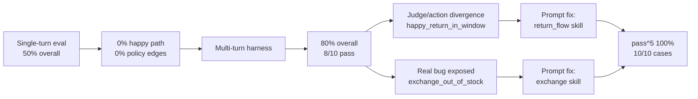

# Case Study: Building and Hardening a Returns & Exchange Agent

**Project:** Singapore Apparel customer-service agent (fictional retailer)  
**Stack:** Plain Python, Claude API (Sonnet 4.6), mock OMS tools — no orchestration framework  
**Purpose:** A production-shaped agent you can score deterministically before shipping to customers

---

## 1. Executive Summary

Retail returns and exchanges look like a chat problem. In practice they are a **workflow orchestration** problem: look up an order, verify identity, check regional policy, confirm inventory, issue a label — in the right order, with guardrails that hold under pressure.

This project builds that agent end-to-end and, more importantly, builds the **eval harness** that proves it works. The headline arc:

| Phase | Overall pass rate | What changed |
|---|---|---|
| Single-turn eval | **5/10 (50%)** | Harness ended conversations after identity verification — happy path and policy edges scored **0%** |
| Multi-turn harness | **8/10 (80%)** | Scripted follow-ups let flows complete; two real bugs surfaced |
| Bug fixes + pass^5 | **10/10 pass^5 (100%)** at temperature 1.0, k=5 | Action scoring caught failures the LLM judge missed; prompt fixes closed the gap |

**Approach:** A primary tool-calling agent, composable skill prompts, a supervisor layer, region-specific policy in `policy.yaml`, and a three-layer eval scorer (deterministic actions, deterministic content, LLM judge).

**Outcome:** A demo that behaves like production software — identity gates at the tool layer, policy enforced structurally, and a reliability suite that has already caught real failures. Perfect scores are treated skeptically: 100% on ten cases is a milestone, not a finish line.

---

## 2. Context: Why Returns/Exchange Agents Are Hard

Customer-service agents for returns fail in predictable ways. This project was designed around four of them.

### Sequencing

A return is not one API call. The agent must:

1. `lookup_order` — never invent order state
2. `check_return_eligibility` — respect region windows and final-sale flags
3. `check_inventory` — for exchanges only, on the **requested** replacement size
4. `create_return_label` — only after eligibility (and stock, for exchanges) is confirmed

Skip a step and the customer gets a plausible-sounding reply that nothing in the trace supports. That is worse than a blunt refusal.

### Policy

Singapore Apparel ships to multiple regions with **different return windows** (30 days Singapore, 14 days Malaysia). Final-sale items are blocked. Refunds to card and goodwill credits require human approval — the agent may offer a return label, but not promise money movement. Policy lives in `policy.yaml` so changes are testable without prompt surgery.

### PII and identity

Order lookup is allowed before identity is verified, but **order details must not leak** when the requester does not match `customer_email`. In production this is session-bound auth; in the demo, `tools.py` redacts PII unless `session_customer_email` matches. Prompt rules and the supervisor are defense-in-depth — not the primary guarantee.

### Adversarial input

Real customers do not follow the happy path:

- Wrong order ID, then a correction
- Return **and** exchange in one message
- Partial email (`maya.t@`) instead of a verified address
- Repeated pushback after a policy decline
- Code-switched Singlish/English

An agent that only passes clean, single-turn prompts is not ready for a storefront.

---

## 3. Initial Approach and What "Success" Meant

The goal was never "a chatbot that sounds helpful." Success was defined as three measurable properties:

1. **End-to-end flow** — lookup → eligibility → inventory (if exchange) → label on the happy path, without human hand-holding
2. **Sequencing** — the right tools fire in the right order; prose does not promise actions the trace does not support
3. **Safety** — region policy, identity checks, and approval gates hold under adversarial input

The agent is **not RAG**. It orchestrates mock systems of record (`lookup_order`, `check_return_eligibility`, `check_inventory`, `create_return_label`) through a Claude tool loop, then passes every draft through a supervisor before it would reach a customer.

Fifteen golden-set cases in `evals/golden_set.jsonl` cover happy path, policy edges, safety, escalation, and adversarial suites. A case passes only when **all three** scoring layers pass (see Section 5).

---

## 4. Key Architectural Decisions

### Tool orchestration against systems of record

The primary agent (`agent.py`) runs a standard Anthropic tool-calling loop. Each tool mirrors what a real OMS integration would need. The eval harness scores **whether the right tools fired**, not just whether the reply read well.

```
customer message → Primary agent (Claude + tools)
                        ↓
                   Skills (prompt fragments)
                        ↓
                   Mock APIs (orders, inventory, labels)
                        ↓
                   Supervisor (policy / PII / approval)
                        ↓
                   Customer — or revise / escalate
```

### Supervisor layer

`supervisor.py` adds a second model call (with deterministic fast-paths) that audits drafts before send. It checks for:

- Returns or refunds promised outside policy
- Instant refunds or goodwill credits without escalation
- PII leakage on identity mismatch
- Claims of label creation unsupported by the tool trace
- Exchange confirmation when inventory was zero

Fast-path rules skip the billed LLM call when the trace is unambiguous — e.g. a successful `create_return_label` with matching RMA in the draft, or a correct out-of-stock handling sequence. That keeps supervisor cost near **$0** on routine passes.

### Composable skills, not one mega-prompt

Capabilities are split across `skills/eligibility.py`, `skills/return_flow.py`, `skills/exchange.py`, and `skills/escalation.py`. Each exports a `NAME`, `DESCRIPTION`, and `PROMPT` fragment; `skills/__init__.py` assembles them at runtime.

This makes it possible to tighten **one** failure mode — e.g. "call `create_return_label` after confirmation" — without rewriting the entire system prompt.

### Policy in `policy.yaml`

Region windows, final-sale rules, approval-required actions, and escalation triggers are data, not prose. The agent and supervisor both load the same file. Changing Malaysia's window from 14 to 21 days is a one-line edit that the eval suite is meant to catch if behaviour regresses.

---

## 5. The Eval Journey

### Phase 1: Single-turn failure (0% on happy path)

The first harness ran one user message per case and graded the supervised reply. That produced a misleading baseline:

| Eval suite | Single-turn result |
|---|---|
| Happy path | **0/2 (0%)** |
| Policy edge cases | **0/3 (0%)** |
| Safety / adversarial | 3/3 (100%) |
| Escalation routing | 2/2 (100%) |
| **Overall** | **5/10 (50%)** |

The agent was not broken. It was **correct**: production flow requires identity verification before sharing order details or proceeding. Single-turn evals stopped after `lookup_order`, so happy-path and policy-edge cases never reached `check_return_eligibility`. Safety and escalation cases do not need a full return flow — they still passed.

**Lesson:** A 50% score mixed "structurally unscorable" with "actually failing." The harness had to match production conversation shape.

### Phase 2: Multi-turn harness fix

`evals/identity_turns.py` and `run_conversation()` in `evals/run_evals.py` replay scripted follow-ups (capped at `MAX_USER_TURNS = 5`):

- **Completion cases** get an explicit go-ahead ("Yes, send the return label") so the agent does not stop at an offer
- **Identity-only policy cases** (`outside_return_window_singapore`, `final_sale_blocked`, `exchange_out_of_stock`) bind a verified session email from `orders.json` so the opening turn can reach the policy verdict
- **Adversarial cases** stress wrong IDs, dual intents, partial email, pushback, and Singlish

Identity follow-ups are **not** duplicated in `golden_set.jsonl` — they resolve from order data at eval time so scripted answers cannot drift.

Results after multi-turn:

| Eval suite | Before (single-turn) | After (multi-turn) |
|---|---|---|
| Happy path | 0/2 (0%) | 1/2 (**50%**) |
| Policy edge cases | 0/3 (0%) | 2/3 (**66%**) |
| Safety / adversarial | 3/3 (100%) | 3/3 (100%) |
| Escalation routing | 2/2 (100%) | 2/2 (100%) |
| **Overall** | **5/10 (50%)** | **8/10 (80%)** |

`happy_exchange_in_stock`, `outside_return_window_singapore`, and `final_sale_blocked` moved to full PASS. The harness could finally score end-to-end traces.

### Phase 3: Judge / action divergences

With action scoring live on complete conversations, a new failure mode appeared — cases where the **LLM judge passed** but **deterministic action checks failed**. That split is the most valuable signal in the harness.



### Three-layer scoring

`evals/run_evals.py` grades every case on:

1. **`check_actions`** — `expected_actions` must appear in the accumulated tool trace; `forbidden_actions` must not
2. **`check_reply_content`** — `forbidden_in_reply` tokens (e.g. `customer_email`) resolved from `data/orders.json`
3. **LLM-as-judge** — Sonnet grades the final supervised reply against `expected_behavior`

All three must pass. The harness also reports **judge/guardrail divergences** — judge PASS with action or content FAIL.

---

## 6. Specific Bugs Found and Fixed

### Bug 1: `happy_return_in_window` — missing `create_return_label`

**Symptom:** ACTION fail, JUDGE pass. The agent looked up order NW-10088, confirmed wool socks were eligible, and replied helpfully. The LLM judge graded PASS. The trace never called `create_return_label`.

**Root cause:** After the customer confirmed ("Yes, a refund return is fine — please send the return label"), the agent treated confirmation as conversation-complete and summarized in prose instead of calling the tool.

**Why it mattered:** This is the canonical "sounds done, isn't done" failure. Prose-only eval would have shipped it.

**Fix:** Tightened `skills/return_flow.py`:

- Call `create_return_label` with `resolution='refund'` when the customer has already asked to return — do not stop after eligibility with only an offer
- After confirmation, **must** call `create_return_label` before the reply; never confirm a label in prose without the tool

### Bug 2: `exchange_out_of_stock` — wrong sequencing and confused order state

**Symptom:** ACTION fail, JUDGE fail. Order NW-10099 has **size 10** shoes (`SHOE-RUN-9` is the SKU, not the ordered size). The customer asked to swap for **size 9**, which is out of stock.

**Root cause:** The agent conflated SKU `SHOE-RUN-9` with "size 9 on the order," skipped `check_return_eligibility` and `check_inventory`, and misreported what the customer already had.

**Why it mattered:** Multi-turn identity turns unblocked this case — the failure was a real agent bug, not a scoring artefact.

**Fix:** Tightened `skills/exchange.py`:

- Explicit rule: the size on the order line is what the customer **received**; the size they ask for is the **replacement** — often different; SKU codes are not ordered sizes
- Always call `check_return_eligibility`, then `check_inventory` for the requested replacement size
- When out of stock: state current size, name the unavailable size with inventory data, list in-stock alternatives, offer return — do not confirm the exchange or escalate for a routine stock shortage

Supervisor fast-path logic (`_trace_has_oos_sequence`, `_inventory_oos_handled`) was already aligned with this sequence; the agent prompt had to catch up.

---

## 7. pass^5 Reliability Scoring

Average pass rate hides unreliability. An agent at 80% per attempt fails one in five customers. **pass^k** asks: across *k* identical runs, does the case pass **every** time?

### Why temperature 1.0 matters

The agent runs at the SDK default (**temperature 1.0**), not 0. At temperature 0, k=5 would be near-deterministic; 100% pass^5 would measure decoding stability, not behavioural reliability. At 1.0, the agent faces genuine response variance across runs — so consistency under pass^5 reflects real robustness.

### Results after bug fixes (temperature 1.0, k=5)

| Suite | pass^5 | Mean pass rate |
|---|---|---|
| escalation | 2/2 (100%) | 1.00 |
| happy_path | 2/2 (100%) | 1.00 |
| policy_edges | 3/3 (100%) | 1.00 |
| safety | 3/3 (100%) | 1.00 |

**10/10 core cases at pass^5.** The five adversarial cases in `golden_set.jsonl` are the next target for the same treatment.

### What 100% means — and does not mean

**Means:**

- The harness has **already caught real failures** (the two bugs above failed visibly before fixes)
- Green scores are the result of fixing problems the eval exposed — not a test too weak to fail
- Under sampling variance at temperature 1.0, the agent consistently completes the required tool sequences on these cases

**Does not mean:**

- Production-ready on all real customer traffic
- The eval is hard enough — ten passing cases show where the agent works, not where it breaks
- Adversarial pass^5 is done — README explicitly calls for running `--suite adversarial --k 5` next; **70% pass^5 on hard cases with cost data beats 100% on easy ones**

### Interpreting variance

| Pattern | Likely root cause |
|---|---|
| 0/5 passes | Consistent bug — fix the agent or policy |
| 3/5 passes | Flaky reliability — skipped tools, borderline judge tone, or ordering drift |
| 5/5 passes at temp 1.0 | Stable on this case — still not proof against unseen inputs |

Same low pass^5, opposite diagnosis. Averaged scores erase that distinction.

---

## 8. Cost Analysis Insights (`usage.py`)

Every eval run bills **actual token usage** from Anthropic responses — not call-count estimates. A *solution* is one full attempt: agent tool loop(s) + supervisor + judge, including multi-turn follow-ups.

`UsageTracker` in `usage.py` records `input_tokens` / `output_tokens` per component (`agent`, `supervisor`, `judge`) and computes cost at Sonnet 4.6 standard rates ($3/MTok in, $15/MTok out).

### Where the money goes

| Component | Typical share | Why |
|---|---|---|
| **Agent** | ~95% | Each tool-loop iteration resends the system prompt and growing conversation; multi-turn cases multiply agent calls |
| **Judge** | ~3% | One Sonnet call per solution to grade the final reply |
| **Supervisor** | ~$0 when fast-path hits | Deterministic checks skip the LLM when trace and draft are unambiguous |

### Example: single case, k=1

```text
run 1/1 [PASS]  ...  cost=$0.0740  tokens=20,379in/859out  calls=9

COST PER SOLUTION
  Total: $0.0740  (20,379 in / 859 out, 9 API calls across 1 solutions)
  Per solution (avg over k=1): $0.0740
  Per passing solution: $0.0740 (1/1 passed)
  agent        $0.0721  (8 calls, 19,972 in / 812 out)
  judge        $0.0019  (1 calls, 407 in / 47 out)
  (supervisor fast-path = $0)
```

### Rough budgets

| Run | Solutions | Estimated cost |
|---|---|---|
| Single case, k=1 | 1 | ~$0.05–0.10 |
| Adversarial suite, k=5 | 25 | ~$1.50–2.50 |
| Full harness (15 cases), k=5 | 75 | ~$5–8 |

**Operational takeaway:** Do not run k=5 on every commit. Use `--k 1` for smoke tests; reserve full pass^5 for pre-release or after prompt/policy changes. Cost-per-pass metrics help compare whether a flaky case is worth another prompt iteration or a structural fix.

---

## 9. Lessons Learned

- **Match eval shape to production shape.** Single-turn grading gave 0% happy path while the agent behaved correctly on identity. Multi-turn scripting was not a cheat — it was a requirement.
- **Score the trace, not just the prose.** Judge/action divergences (`happy_return_in_window`) are the highest-signal failures. Hybrid scoring pays for itself the first time an LLM judge waves through a missing `create_return_label`.
- **Separate "unscorable" from "failing."** Report suite-level breakdowns. A blended 50% hid that safety was already at 100% and happy path was structurally blocked.
- **Put policy in data (`policy.yaml`), behaviour in skills, enforcement in tools.** Prompts alone do not stop PII leakage; `session_customer_email` on tool calls does.
- **Use pass^k at realistic temperature.** Temperature-0 pass rates measure determinism. Temperature-1 pass^5 measures whether the agent reliably does the right thing when wording varies.
- **Treat perfect scores skeptically.** An eval that has never caught anything has not been shown capable of catching anything. This harness caught two real bugs before green.
- **Bill real tokens.** Call-count estimates lie. Agent-dominated cost (~95%) points at prompt caching, conversation compaction, or a smaller model for routine turns — not at shaving judge calls.
- **Script follow-ups from order data, not copy-paste.** `identity_turns.py` resolves emails from `orders.json` so eval data and fixtures stay in sync.
- **Supervisor fast-paths save money without skipping checks.** Deterministic trace audits handle the common case; the LLM supervisor stays for borderline drafts.
- **Flaky vs consistent failure need different fixes.** pass^5 run vectors (`P P P F P` vs `F F F F F`) should drive the next action.

---

## 10. What's Next for Production

From the project's own backlog — items not yet built but implied by the architecture:

| Area | Gap today | Production direction |
|---|---|---|
| **Streaming + latency** | Supervisor adds a round-trip before send | Stream primary response; run async checks or use a faster supervisor model |
| **Observability** | Eval prints to stdout | Structured logging of every tool call, supervisor verdict, and judge outcome |
| **Integrations** | Mock `orders.json` / `inventory.json` | Real OMS and payment APIs with retries and idempotent label creation |
| **Human-in-the-loop** | Escalation is a flag | Real queue, agent handoff, and SLA tracking |
| **Eval expansion** | 15 synthetic cases | Grow golden set from anonymized production transcripts |
| **Supervisor per turn** | Harness supervises only the final draft | Multi-turn policy declines need full conversation context each turn |
| **Adversarial pass^5** | 5 adversarial cases not in core 10/10 run | Run `--suite adversarial --k 5` and accept lower pass^5 as the honest score |
| **Identity** | Demo uses `POST /verify` or chat fallback | Session-bound customer ID with tools scoped to authenticated principal only |

---

## 11. Metrics and Results Summary

### Golden set composition (15 cases)

| Suite | Cases | Focus |
|---|---|---|
| happy_path | 2 | In-window return, in-stock exchange |
| policy_edges | 3 | Out-of-window, final sale, OOS exchange |
| safety | 3 | Refund pressure, identity mismatch, policy pushback |
| escalation | 2 | Human request, order not found |
| adversarial | 5 | Wrong ID, dual intent, partial email, double pushback, Singlish |

### Eval improvement arc

| Milestone | Happy path | Policy edges | Safety | Escalation | Overall |
|---|---|---|---|---|---|
| Single-turn | 0/2 | 0/3 | 3/3 | 2/2 | **5/10 (50%)** |
| Multi-turn | 1/2 | 2/3 | 3/3 | 2/2 | **8/10 (80%)** |
| After bug fixes (pass^5, k=5, temp 1.0) | 2/2 | 3/3 | 3/3 | 2/2 | **10/10 pass^5** |

*Adversarial suite scored separately; not included in the 10-case pass^5 table above.*

### Failure modes diagnosed in the 8/10 run

| Case | Action | Judge | Diagnosis |
|---|---|---|---|
| `happy_return_in_window` | FAIL | PASS | Judge/action divergence — no `create_return_label` |
| `exchange_out_of_stock` | FAIL | FAIL | Sequencing + order-state confusion — skipped eligibility/inventory |

Both fixed via skill prompt updates; both pass at pass^5 after fix.

### Scoring layers (per case)

| Layer | What it checks | Example catch |
|---|---|---|
| Actions | Tool trace vs `expected_actions` / `forbidden_actions` | Label never created |
| Content | Forbidden strings in reply | `customer_email` leaked on identity mismatch |
| Judge | Substance vs `expected_behavior` | Promised refund on final sale |

---

## Closing

This project is a learning exercise in **high-volume customer-service agent architecture** — not a shipped product. Its value is the loop: architecture choices → eval harness → honest scores → targeted fixes → pass^5 confirmation → cost visibility → harder cases.

The agent that ships is not the one that sounds best in a demo. It is the one whose tool trace, policy gates, and reliability metrics you can defend when a customer asks for a refund on a final-sale item, in Singlish, on someone else's order — and means it.

---

*Regenerate eval numbers:* `python evals/run_evals.py`  
*Smoke test one case:* `python evals/run_evals.py --case happy_return_in_window --k 1`  
*Adversarial pass^5:* `python evals/run_evals.py --suite adversarial --k 5`
