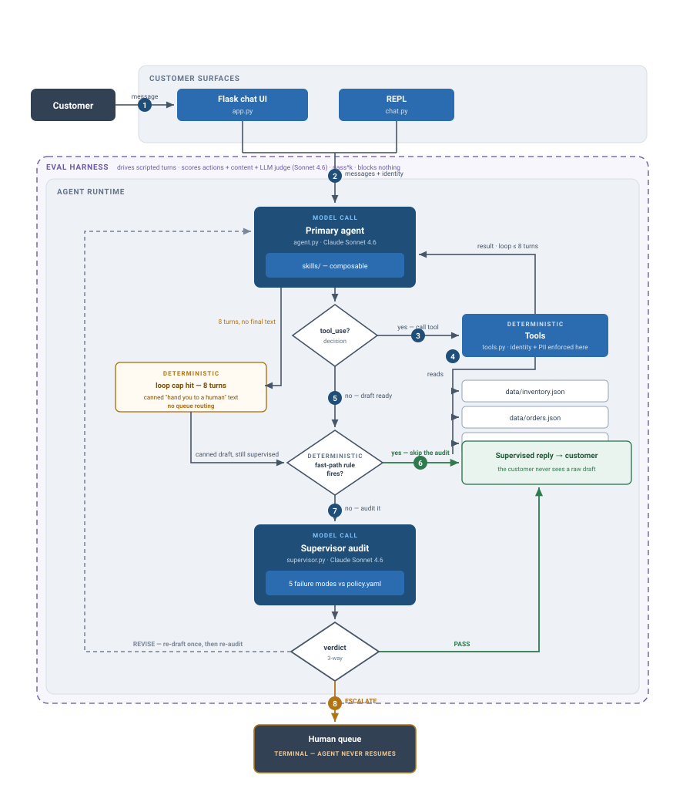

# Returns & Exchange Agent

*Can an agent be made reliable enough to act on a customer's behalf — and does that reliability survive a change of store?*

Anna Gibaeva · solo build · plain Python, Claude API, no orchestration framework

**Status:** three iterations shipped · pass^5 gate wired, awaiting its API-key secret · adversarial suite written but unrun

---

## Page 1 — Summary

### Use case

A customer of **Singapore Apparel** — a hypothetical mid-size apparel retailer, synthetic data throughout — asks over chat to return or exchange an order. In one turn the agent verifies the requester's identity against the order, looks the order up, checks the return window and final-sale status against policy, checks replacement inventory if it's an exchange, and creates a return label — then a second model call audits that draft before it reaches the customer.

The agent may **create return labels and confirm in-stock exchanges on its own**. It may never issue a refund or goodwill credit, never override a return window or a final-sale flag, and never reveal order details to a requester whose identity doesn't match the order. Those paths propose-and-escalate rather than execute.

### Business constraints

| Constraint | Where it lives |
|---|---|
| Refunds and goodwill credits require human approval | `policy.yaml → approval_required` |
| Return window is region-specific (30d SG / 14d MY) | `policy.yaml`, read at runtime — not baked into prompts |
| Final-sale items are not returnable; overrides need approval | `policy.yaml` |
| Order details are withheld on identity mismatch | enforced structurally in `tools.py` via session email, not by prompt instruction |
| The customer never sees a raw model draft | `supervised_reply()` — every surface displays the supervised reply |

### Iterations

**Iteration 1 — Agent + mock systems of record** · `SHIPPED`

Plain-Python agent on Claude Sonnet 4.6. Tool loop capped at 8 turns over four mock tools (`lookup_order`, `check_return_eligibility`, `check_inventory`, `create_return_label`) reading synthetic JSON records. Policy lives in `policy.yaml` and is read at runtime, so a policy change doesn't require a prompt edit. The single-turn eval could not score task completion at all: the agent pauses to verify identity, and the conversation ended before it could finish, so `happy_path` and `policy_edges` scored 0% for structural reasons rather than agent failure.

**Iteration 2 — Supervisor + reliability harness** · `SHIPPED`

A second Sonnet call audits every draft against policy before send and returns PASS, REVISE or ESCALATE. In front of it, two deterministic rules approve tool-backed replies without spending the model call, and fail closed when identity is unverified or the draft might leak PII. A scripted multi-turn harness lets cases run to completion; scoring is three layers (expected/forbidden actions in the trace, forbidden content in the reply, LLM judge on substance) and a case passes only if all three pass. `pass^k` at temperature 1.0, and every eval run bills real token usage.

**Iteration 3 — External validation on τ²-bench** · `SHIPPED`

The same agent against Sierra's τ²-bench retail: 114 tasks, an LLM-simulated customer, and grading on the store's final database state rather than the conversation. It scored 59/114 with the Singapore Apparel supervisor and skills in place, and 92/114 after switching the supervisor off for that store and rewriting the skills around τ²-bench's tool names and write path.

### Iteration table

| Iter. | Cost & latency factors | Optimizations | Guardrails | Eval metrics |
|---|---|---|---|---|
| **1** | Up to 8 Sonnet 4.6 calls per turn in the tool loop. Single model tier throughout — no cheap/strong split. | Policy in config rather than prompt. Skills composed into a cached system prefix (`cache_control: ephemeral`). | Identity enforced in the tool layer, not by instruction. PII redaction on tool results. | **NOT MEASURED** — single-turn harness structurally could not reach task completion; the 0% on `happy_path` / `policy_edges` measured the harness, not the agent. |
| **2** | **MEASURED** — $0.074 per solved case (n=1 case, k=1): agent $0.0721 over 8 calls, judge $0.0019, supervisor $0 that run (fast path hit). **PROJECTED** — ~15–25s per turn, derived from call count and never timed. | Two deterministic fast-path rules skip the supervisor's model call on tool-backed replies. Cached system prefix. Judge call is eval-only, never on the live path. | Supervisor checks five failure modes. Fail-closed on identity. Revision capped at one attempt. An unparseable verdict escalates rather than sends. | **MEASURED** — pass^5 = 100% on 10 core cases at temperature 1.0 (n = 10 cases × 5 runs). Three-layer scoring caught 2 real bugs the judge alone passed; judge/action divergence reported per run. |
| **3** | Supervisor added one model call per text turn **and** lost tasks — cost without benefit on this store. Benchmark runs are 1 trial × 114 tasks. | Supervisor off for τ²-bench, on for Singapore Apparel. Skills rewritten to the host store's tool names. Write-path rules: confirm before write, one action per turn, exact enum strings, calculator before quoting amounts. | The supervisor is scoped to one deployment's policy and is explicitly disabled off-domain — treated as a per-customer component, not part of the agent. | **MEASURED** — 59/114 (52%) → 92/114 (81%), n = 1 trial per task. Side A/B, n = 6: 2/6 supervisor on vs 4/6 off. Reads 93.8%, writes 83.5%, DB match 82.5%. |

### Open items

1. **The gate is wired but not yet armed.** `.github/workflows/evals.yml` runs `pass^5` at `--min-pass-k 1.0` across the four core suites on every PR into `main`, and `run_evals.py` now exits non-zero when the bar isn't met. It skips with a warning until `ANTHROPIC_API_KEY` is set on the repository, so until that secret exists it reports rather than blocks.
2. **Only one of the two bars is pre-registered.** The pass^5 bar now lives in the workflow (`--min-pass-k 1.0`) and is declared before a run. The τ²-bench comparison had no threshold written down beforehand, so 52% → 81% was interpreted after the fact.
3. **The supervisor verdict is discarded in the eval.** `run_evals.py` binds it to `_verdict`, so a case that passed cleanly and a case that passed only after a REVISE are the same number. Cost per resolved case can't be split by path either.
4. **Latency never instrumented.** The supervisor's extra round-trip per text turn is unquantified.
5. **pass^5 = 100% partly reflects a measurement change.** The harness moved from single-turn to multi-turn in the same iteration the bugs were fixed; no control arm separates "agent got better" from "harness could finally reach the end."
6. **Escalation is a dead end.** No retry and no bounded clarification attempt before handing to a human — the cheapest real improvement available.
7. **The 100% is on the easy set.** Five adversarial cases are written and have never been run at pass^5.
8. **22 τ²-bench failures uncategorised.** Known to cluster in writes; no root-cause breakdown yet.
9. **No model tiering.** Agent, supervisor and judge all run Sonnet 4.6. A cheaper supervisor is the obvious untested cost lever.

---

## Page 2 — Architecture

Top to bottom: the runtime path for one customer turn. Every model call is its own node, deterministic steps are marked, and the refusal path is drawn as a first-class outcome rather than an afterthought.

  

This is the same diagram the README carries — one canonical flow, not a second drawing that can drift out of step with it.

**Reading the diagram.** Three model calls can occur in a single turn: the agent's plan (up to 8 in the tool loop), the supervisor's audit, and at most one re-draft. Every node is tagged `MODEL CALL` or `DETERMINISTIC`, so the split between what the model decides and what code enforces is readable at a glance — identity and PII live in the tool layer, and the fast-path rule test is code, not judgement.

**Three things the diagram deliberately makes ugly.** The loop cap exits to a canned "let me hand you to a human" string that is routed nowhere — it reads as a handoff and isn't one. The human queue is marked terminal because the agent never resumes that conversation. And the eval harness is a dashed frame because it observes and blocks nothing.

**Where each iteration sits on the flow:**

1. **Iteration 1** built everything from `Customer turn` through the tool loop and back — the spine and the loop, with no supervisor and no reachable end state in the eval.
2. **Iteration 2** added the fast path, the supervisor audit, the verdict branch and the REVISE loop, and made the eval harness node real enough to catch two bugs.
3. **Iteration 3** turned the supervisor branch **off** for a store it wasn't written for, and hardened the write path inside the tool loop. Nothing else on the diagram changed.
